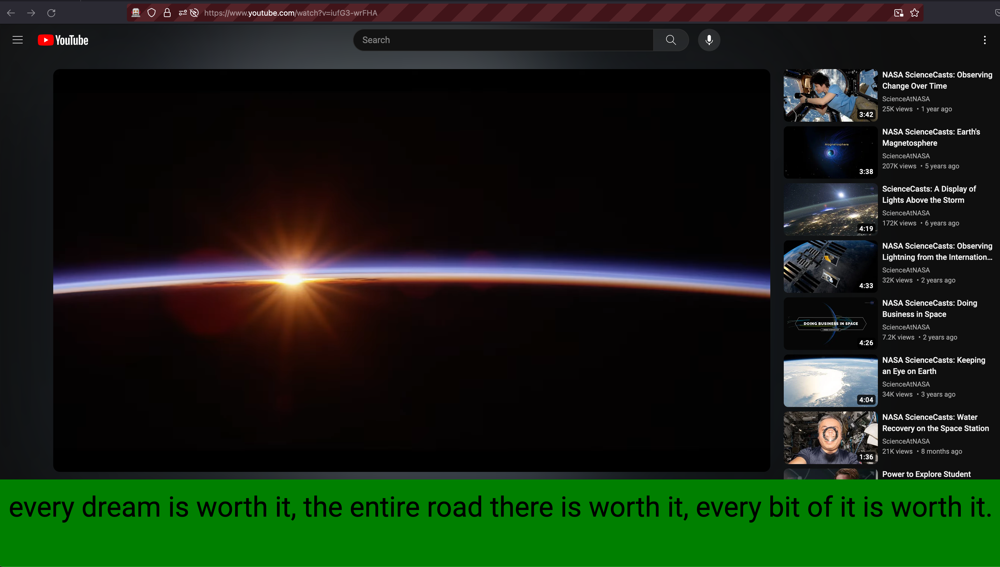

# YT Non-blocking CC

prototype Firefox extension. This presents the captions (CC) on youtube below the video.

## Dev

* run this tool in managed Firefox

```
web-ext run
```

* Navigate to a yt video page (ex: https://www.youtube.com/watch?v=iufG3-wrFHA) in this new Firefox window
* Make sure CC is turned on
* Watch the video with CC that is (mostly) not on top or blocking the video



Note: the screenshot video (https://www.youtube.com/watch?v=iufG3-wrFHA) is `Creative Commons Attribution license (reuse allowed)`

## Setup

```
brew install web-ext
```
